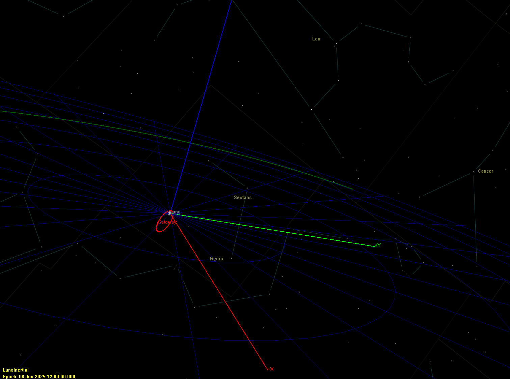

# Artemis Lunar Gateway NRHO Analysis

Mission analysis and trajectory design for NASA's Artemis Lunar Gateway using GMAT (General Mission Analysis Tool).

## Overview

This project analyzes Near-Rectilinear Halo Orbit (NRHO) trajectories for the Artemis Lunar Gateway station, demonstrating lunar transfer design and Gateway orbital mechanics.

## Mission Scenarios

### NRHO Gateway Orbit
- **Orbit Type:** Near-Rectilinear Halo Orbit
- **Semi-major Axis:** 10,000 km
- **Eccentricity:** 0.8
- **Inclination:** 90°
- **Central Body:** Moon
- **Period:** ~7 days 

## Technical Details

**Software:** NASA GMAT R2022a  
**Coordinate System:** Luna-centered inertial  
**Force Model:** Point mass (Earth + Moon)  
**Propagator:** Numerical integration

## Results

- Stable NRHO demonstrated over 7-day period
- Orbit characteristics match Artemis Gateway baseline
- Moon-centered reference frame for station-keeping analysis

## Technical Report

📄 [Full Technical Report (PDF)](docs/nrho_technical_report.pdf.pdf)

Comprehensive analysis including:
- Mission design methodology
- Force models and propagation
- Orbital stability results
- ESA/NASA collaboration aspects

## References

- [NASA Artemis Gateway](https://www.nasa.gov/gateway)
- [GMAT Documentation](https://sourceforge.net/projects/gmat/)

## Author

Ginevra Cianci - Aerospace Engineering (Politecnico di Torino/Milano)
